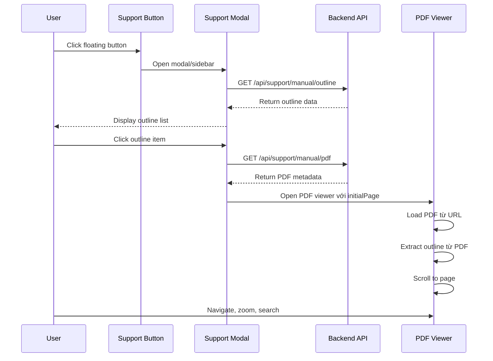
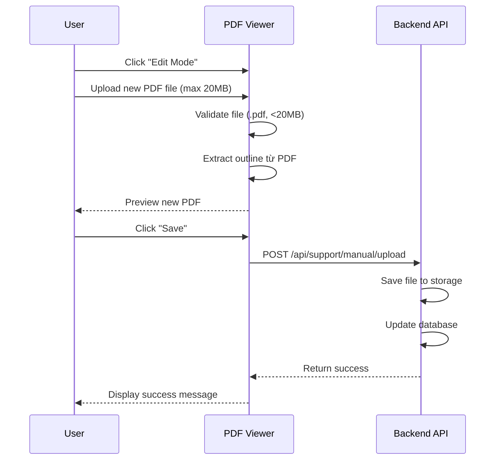

# RoadVision Customer Support System - Technical Documentation

> **Mục đích**: Tổng hợp nghiệp vụ, cấu trúc dữ liệu, API endpoints và màn hình UI để tích hợp vào dự án Vue.js hiện có.

---

## 1. Tổng quan hệ thống

### Kiến trúc hiện tại (Demo)

```
┌─────────────────────────────────────────────────────────────┐
│              Support Portal (Next.js 16 App Router)          │
│  - PDF Manual Viewer với TOC editor                          │
│  - Manual outline navigation                                 │
│  - Widget home screen (embedded mode)                        │
│  - Chat placeholder screen                                   │
└─────────────────────────────────────────────────────────────┘
```

### Kiến trúc đích (Vue.js Integration)

```
┌─────────────────────────────────────────────────────────────┐
│                   Vue.js Application                         │
│  ┌──────────────────────────────────────────────────────┐   │
│  │         Support Component (Floating Button)          │   │
│  │  - Open Modal/Sidebar                                │   │
│  └──────────────────────────────────────────────────────┘   │
│  ┌──────────────────────────────────────────────────────┐   │
│  │         Support Modal/Page                           │   │
│  │  - Manual outline navigation                         │   │
│  │  - PDF viewer với TOC                                │   │
│  │  - Chat interface (future)                           │   │
│  └──────────────────────────────────────────────────────┘   │
└─────────────────────────────────────────────────────────────┘
```

### Technology Stack (Recommended cho Vue.js)

- **Frontend**: Vue 3 Composition API, TypeScript
- **State Management**: Pinia
- **PDF Rendering**: `vue-pdf-embed` hoặc `pdfjs-dist`
- **HTTP Client**: Axios hoặc Fetch API
- **Styling**: TailwindCSS (hoặc framework hiện tại)
- **Backend**: Express.js / Fastify / NestJS (tùy chọn)

---

## 2. Luồng nghiệp vụ (Business Flows)

### 2.1 Luồng sử dụng Manual



### 2.2 Luồng edit Manual (Tùy chọn)



### 2.3 Luồng Chat (Planned - Chưa triển khai)

```
User clicks support button
→ Open modal
→ Choose "Chat với operator"
→ Redirect to chat interface
  - Realtime chat (WebSocket/SSE)
  - Chat history
  - File attachment
  - Operator online status
```

---

## 3. Cấu trúc dữ liệu

### 3.1 Manual Outline Structure

```typescript
interface OutlineItem {
  id: string;                    // Unique identifier (e.g., "2-1. システム概要")
  title: string;                 // Section title (Japanese)
  page: number;                  // PDF page number (1-indexed)
  children?: OutlineItem[];      // Nested sections (optional)
}
```

**Ví dụ dữ liệu**:

```json
[
  {
    "id": "2-1. システム概要",
    "title": "1. システム概要",
    "page": 4,
    "children": [
      { "id": "3-1.1 概要", "title": "1.1 概要", "page": 4 },
      { "id": "4-1.2 操作手順", "title": "1.2 操作手順", "page": 4 },
      { "id": "5-1.3 入力項目", "title": "1.3 入力項目", "page": 4 }
    ]
  },
  {
    "id": "7-2. ログインと初期設定",
    "title": "2. ログインと初期設定",
    "page": 5,
    "children": [
      { "id": "8-2.1 概要", "title": "2.1 概要", "page": 5 }
    ]
  }
]
```

### 3.2 Manual PDF Metadata

```typescript
interface ManualPdf {
  pdfUrl: string;                // URL to PDF file (relative or absolute)
  fileName?: string;             // Display filename
  updatedAt?: string;            // Last modified (YYYY/MM/DD HH:mm format)
  size?: string;                 // File size string (e.g., "86.6KB")
}
```

**Ví dụ**:

```json
{
  "pdfUrl": "/tai_lieu_quan_ly_duong_bo_co_muc_luc.pdf",
  "fileName": "tai_lieu_quan_ly_duong_bo_co_muc_luc.pdf",
  "updatedAt": "2026/06/11 14:30",
  "size": "86.6KB"
}
```

### 3.3 Flat Outline Item (for display in list)

Khi hiển thị outline dạng danh sách phẳng (không có nested tree), cần flatten data:

```typescript
interface FlatOutlineItem {
  id: string;
  title: string;
  page: number;
  level: number;               // Nesting level (0 = top level)
  hasChildren?: boolean;       // Có children hay không
}
```

**Function flatten outline**:

```typescript
function flattenOutline(items: OutlineItem[], level = 0): FlatOutlineItem[] {
  return items.flatMap((item) => [
    {
      id: item.id,
      title: item.title,
      page: item.page,
      level,
      hasChildren: !!item.children?.length
    },
    ...(item.children ? flattenOutline(item.children, level + 1) : [])
  ]);
}
```

---

## 4. API Endpoints

### 4.1 Support APIs

**Base Path**: `/api/support` (hoặc `/api/v1/support`)

| Method | Endpoint | Description | Response Type |
|--------|----------|-------------|---------------|
| GET | `/manual/outline` | Lấy cấu trúc mục lục PDF | `OutlineItem[]` |
| GET | `/manual/pdf` | Lấy metadata PDF hiện tại | `ManualPdf` |
| POST | `/manual/upload` | Upload PDF mới (optional) | `{ success: boolean, pdfUrl: string }` |
| PUT | `/manual/outline` | Cập nhật outline (optional) | `{ success: boolean }` |

#### GET `/api/support/manual/outline`

**Response Example**:

```json
[
  {
    "id": "2-1. システム概要",
    "title": "1. システム概要",
    "page": 4,
    "children": [
      { "id": "3-1.1 概要", "title": "1.1 概要", "page": 4 }
    ]
  }
]
```

#### GET `/api/support/manual/pdf`

**Response Example**:

```json
{
  "pdfUrl": "/tai_lieu_quan_ly_duong_bo_co_muc_luc.pdf",
  "fileName": "tai_lieu_quan_ly_duong_bo_co_muc_luc.pdf",
  "updatedAt": "2026/06/11 14:30",
  "size": "86.6KB"
}
```

#### POST `/api/support/manual/upload` (Optional)

**Request**:
- Content-Type: `multipart/form-data`
- Body: `file` (PDF file)

**Response**:

```json
{
  "success": true,
  "pdfUrl": "/manuals/new_manual_20260612.pdf",
  "fileName": "new_manual.pdf",
  "size": "2.3MB"
}
```

**Validation**:
- File type: `application/pdf` hoặc `.pdf`
- Max size: 20MB
- Extract outline tự động sau khi upload

---

## 5. UI Screens & Components

### 5.1 Support Button (Floating)

**Vị trí**: Fixed bottom-right (hoặc bottom-left)

**Behavior**:
- Click → Open modal/sidebar
- Hiển thị badge nếu có notification mới (future)

**Component Props**:

```typescript
interface SupportButtonProps {
  position?: 'bottom-right' | 'bottom-left';
  primaryColor?: string;
  iconUrl?: string;
  buttonText?: string;
}
```

---

### 5.2 Support Modal - Home Screen

**Layout**: 2 action cards (hoặc nhiều hơn tùy chỉnh)

**Actions**:
1. **"使い方を調べる"** (Tra cứu cách sử dụng)
   - Icon: BookOpen
   - Description: "よくある質問やマニュアルを確認する"
   - Click → Navigate to Manual Outline screen

2. **"担当者につなぐ"** (Liên hệ người phụ trách)
   - Icon: Headphones
   - Description: "オペレーターと直接チャットで相談する"
   - Click → Open chat interface (hoặc redirect external URL)

**Component Structure**:

```vue
<template>
  <div class="support-modal">
    <header>
      <h1>カスタマーサポート</h1>
      <button @click="close">Close</button>
    </header>
    
    <div v-if="screen === 'home'" class="home-screen">
      <p>こんにちは。どのようなご用件でしょうか？ 以下のオプションからお選びください。</p>
      <button @click="screen = 'manual'">
        <BookOpen />
        <div>
          <strong>使い方を調べる</strong>
          <small>よくある質問やマニュアルを確認する</small>
        </div>
      </button>
      <a :href="operatorUrl" target="_blank">
        <Headphones />
        <div>
          <strong>担当者につなぐ</strong>
          <small>オペレーターと直接チャットで相談する</small>
        </div>
      </a>
    </div>
    
    <ManualOutlineScreen v-else-if="screen === 'manual'" />
  </div>
</template>
```

---

### 5.3 Manual Outline Screen

**Display**: Danh sách outline items (paginated hoặc virtualized)

**Features**:
- ✅ Hiển thị title + page number
- ✅ Pagination (5 items/page hoặc load more)
- ✅ Click item → Open PDF Viewer với initialPage
- ✅ Back button → Return to Home screen

**Component Structure**:

```vue
<template>
  <div class="manual-outline-screen">
    <header>
      <button @click="$emit('back')">← 戻る</button>
      <h2>使い方を調べる</h2>
    </header>
    
    <div v-if="loading" class="loading">
      <Spinner />
      <span>読み込み中...</span>
    </div>
    
    <div v-else class="outline-list">
      <a
        v-for="item in visibleItems"
        :key="item.id"
        :href="`/support/manual?outline=${item.id}`"
        target="_blank"
        class="outline-item"
      >
        <BookOpen />
        <div>
          <strong>{{ item.title }}</strong>
          <small>PDFマニュアル {{ item.page }}ページ</small>
        </div>
      </a>
    </div>
    
    <div v-if="pageCount > 1" class="pagination">
      <button @click="prevPage" :disabled="page === 1">前へ</button>
      <span>{{ page }} / {{ pageCount }}</span>
      <button @click="nextPage" :disabled="page === pageCount">次へ</button>
    </div>
  </div>
</template>
```

---

### 5.4 PDF Manual Viewer (Full Screen)

**Layout**:

```
┌────────────────────────────────────────────────────────┐
│  [Sidebar TOC]          │  [PDF Viewer]               │
│  - Nested outline       │  - Header (title, actions)  │
│  - Expand/collapse      │  - Toolbar (page nav, zoom) │
│  - Active page          │  - PDF canvas               │
│  - Edit TOC mode        │  - Search bar               │
└────────────────────────────────────────────────────────┘
```

**Sidebar TOC Features**:
- ✅ Hierarchical outline (expandable/collapsible)
- ✅ Click item → Scroll to page
- ✅ Active page highlight
- ✅ Page numbers displayed
- ✅ Add/Edit mode (optional)
  - Add new outline item
  - Edit existing item (title, page)

**Toolbar Features**:
- ✅ Page navigation
  - Previous/Next buttons
  - Page input (e.g., "5 / 120")
- ✅ Zoom controls
  - Zoom in/out buttons
  - Zoom percentage display
  - Reset zoom
- ✅ Search in document
- ✅ Download PDF button
- ✅ Fullscreen toggle
- ✅ Edit mode toggle (admin only)

**Edit Mode Features** (Optional):
- ✅ Upload new PDF (drag & drop, file picker)
- ✅ Validation: .pdf only, max 20MB
- ✅ Auto-extract outline from PDF metadata
- ✅ Fallback: Parse printed TOC from first 4 pages
- ✅ Preview before save
- ✅ Save → POST to API

**Component Structure**:

```vue
<template>
  <div class="manual-viewer">
    <!-- Sidebar TOC -->
    <aside class="toc-sidebar">
      <header>
        <h3>目次 (PDF)</h3>
        <div class="actions">
          <button @click="toggleTocMode('add')" :disabled="isEditMode">
            <Plus />
          </button>
          <button @click="toggleTocMode('edit')" :disabled="isEditMode">
            <Edit />
          </button>
        </div>
      </header>
      
      <nav class="toc-list">
        <div v-if="outlineLoading" class="loading">
          <Spinner />
          <span>目次を読み込み中...</span>
        </div>
        <ul v-else>
          <li v-for="item in visibleOutline" :key="item.id">
            <button
              @click="handleOutlineClick(item)"
              :class="{ active: activeOutlineId === item.id }"
              :style="{ paddingLeft: `${12 + item.level * 18}px` }"
            >
              <ChevronDown v-if="item.hasChildren && expanded[item.id]" />
              <ChevronRight v-else-if="item.hasChildren" />
              <BookOpen v-else-if="item.level === 0" />
              <FileText v-else />
              <span>{{ item.title }}</span>
              <span class="page">{{ item.page }}</span>
            </button>
          </li>
        </ul>
      </nav>
    </aside>
    
    <!-- PDF Viewer -->
    <section class="pdf-viewer-container">
      <!-- Header -->
      <header v-if="!isEditMode">
        <div class="title">
          <h1>{{ title }}</h1>
          <p>{{ description }}</p>
        </div>
        <div class="actions">
          <a :href="pdfUrl" download><Download /></a>
          <button @click="isEditMode = true"><Edit /></button>
          <button @click="toggleFullscreen"><Expand /></button>
        </div>
      </header>
      
      <!-- Edit Panel -->
      <section v-if="isEditMode" class="edit-panel">
        <div class="header">
          <div>
            <h2>PDFを編集</h2>
            <p>新しいPDFファイルを選択してドキュメントを更新します。</p>
          </div>
          <div class="actions">
            <button @click="cancelEdit">キャンセル</button>
            <button @click="savePdf" :disabled="!selectedFile">保存</button>
          </div>
        </div>
        <div class="upload-area" @drop="handleDrop" @dragover.prevent>
          <UploadCloud />
          <p>新しいPDFをアップロード</p>
          <p>ここにファイルをドラッグ&ドロップするか、クリックして選択</p>
          <input type="file" accept=".pdf" @change="handleFileSelect" />
        </div>
      </section>
      
      <!-- Toolbar -->
      <div class="toolbar">
        <!-- Page Navigation -->
        <div class="page-nav">
          <button @click="prevPage" :disabled="currentPage <= 1">
            <ChevronLeft />
          </button>
          <input
            type="number"
            v-model.number="pageInput"
            @blur="goToPage(pageInput)"
            :min="1"
            :max="totalPages"
          />
          <span>/ {{ totalPages }}</span>
          <button @click="nextPage" :disabled="currentPage >= totalPages">
            <ChevronRight />
          </button>
        </div>
        
        <!-- Zoom Controls -->
        <div class="zoom-controls">
          <span>{{ zoomPercent }}%</span>
          <button @click="zoomOut"><ZoomOut /></button>
          <button @click="zoomIn"><ZoomIn /></button>
          <button @click="resetZoom"><RotateCcw /></button>
        </div>
        
        <!-- Search -->
        <div class="search-bar">
          <Search />
          <input
            type="search"
            v-model="searchQuery"
            placeholder="ドキュメント内を検索"
            @keyup.enter="submitSearch"
          />
        </div>
      </div>
      
      <!-- PDF Canvas -->
      <div class="pdf-canvas">
        <VuePdfEmbed :source="pdfUrl" :page="currentPage" @loaded="onPdfLoaded" />
      </div>
    </section>
  </div>
</template>
```

---

## 6. Implementation Guide (Vue.js)

### 6.1 Recommended Libraries

```bash
npm install pdfjs-dist
npm install lucide-vue-next  # Icons
npm install @vueuse/core     # Utilities
```

**PDF Rendering Options**:

**Option A**: `vue-pdf-embed` (Recommended - Easier)

```bash
npm install vue-pdf-embed
```

```vue
<script setup>
import VuePdfEmbed from 'vue-pdf-embed'

const pdfSource = ref('/path/to/manual.pdf')
const currentPage = ref(1)
</script>

<template>
  <VuePdfEmbed :source="pdfSource" :page="currentPage" />
</template>
```

**Option B**: `pdfjs-dist` (Advanced - More control)

```bash
npm install pdfjs-dist
```

```typescript
import * as pdfjsLib from 'pdfjs-dist';

pdfjsLib.GlobalWorkerOptions.workerSrc = new URL(
  'pdfjs-dist/build/pdf.worker.min.mjs',
  import.meta.url
).toString();

const pdf = await pdfjsLib.getDocument({ url: pdfUrl }).promise;
const page = await pdf.getPage(pageNumber);
// Render to canvas...
```

### 6.2 State Management (Pinia Store)

```typescript
// stores/supportStore.ts
import { defineStore } from 'pinia'
import type { OutlineItem, ManualPdf } from '@/types/support'

export const useSupportStore = defineStore('support', {
  state: () => ({
    outline: [] as OutlineItem[],
    pdf: null as ManualPdf | null,
    currentPage: 1,
    totalPages: 1,
    zoomPercent: 100,
    activeOutlineId: null as string | null,
    isEditMode: false,
    loading: false
  }),
  
  actions: {
    async fetchOutline() {
      this.loading = true
      try {
        const response = await fetch('/api/support/manual/outline')
        this.outline = await response.json()
      } finally {
        this.loading = false
      }
    },
    
    async fetchPdf() {
      const response = await fetch('/api/support/manual/pdf')
      this.pdf = await response.json()
    },
    
    goToPage(page: number) {
      this.currentPage = Math.max(1, Math.min(page, this.totalPages))
    },
    
    zoomIn() {
      this.zoomPercent = Math.min(this.zoomPercent + 25, 300)
    },
    
    zoomOut() {
      this.zoomPercent = Math.max(this.zoomPercent - 25, 50)
    }
  }
})
```

### 6.3 API Client

```typescript
// api/supportApi.ts
import axios from 'axios'
import type { OutlineItem, ManualPdf } from '@/types/support'

const baseURL = import.meta.env.VITE_API_BASE_URL || '/api/support'

export const supportApi = {
  async getOutline(): Promise<OutlineItem[]> {
    const { data } = await axios.get(`${baseURL}/manual/outline`)
    return data
  },
  
  async getPdf(): Promise<ManualPdf> {
    const { data } = await axios.get(`${baseURL}/manual/pdf`)
    return data
  },
  
  async uploadPdf(file: File): Promise<{ success: boolean; pdfUrl: string }> {
    const formData = new FormData()
    formData.append('file', file)
    const { data } = await axios.post(`${baseURL}/manual/upload`, formData, {
      headers: { 'Content-Type': 'multipart/form-data' }
    })
    return data
  }
}
```

### 6.4 Backend Implementation Example (Express.js)

```typescript
// server/routes/support.ts
import express from 'express'
import multer from 'multer'
import path from 'path'
import fs from 'fs/promises'

const router = express.Router()

// Static data (replace with database later)
const manualOutline: OutlineItem[] = [
  // ... data from support-data.ts
]

const manualPdf: ManualPdf = {
  pdfUrl: '/manuals/tai_lieu_quan_ly_duong_bo_co_muc_luc.pdf',
  fileName: 'tai_lieu_quan_ly_duong_bo_co_muc_luc.pdf',
  updatedAt: '2026/06/11 14:30',
  size: '86.6KB'
}

// GET /api/support/manual/outline
router.get('/manual/outline', (req, res) => {
  res.json(manualOutline)
})

// GET /api/support/manual/pdf
router.get('/manual/pdf', (req, res) => {
  res.json(manualPdf)
})

// POST /api/support/manual/upload (Optional)
const upload = multer({
  dest: 'uploads/',
  limits: { fileSize: 20 * 1024 * 1024 }, // 20MB
  fileFilter: (req, file, cb) => {
    if (file.mimetype === 'application/pdf' || file.originalname.endsWith('.pdf')) {
      cb(null, true)
    } else {
      cb(new Error('Only PDF files are allowed'))
    }
  }
})

router.post('/manual/upload', upload.single('file'), async (req, res) => {
  try {
    const file = req.file
    if (!file) {
      return res.status(400).json({ success: false, message: 'No file uploaded' })
    }
    
    const destPath = path.join('public/manuals', `${Date.now()}_${file.originalname}`)
    await fs.rename(file.path, destPath)
    
    // TODO: Extract outline from PDF, update database
    
    res.json({
      success: true,
      pdfUrl: `/manuals/${path.basename(destPath)}`,
      fileName: file.originalname,
      size: `${(file.size / 1024).toFixed(1)}KB`
    })
  } catch (error) {
    res.status(500).json({ success: false, message: error.message })
  }
})

export default router
```

### 6.5 Router Configuration (Vue Router)

```typescript
// router/index.ts
import { createRouter, createWebHistory } from 'vue-router'

const routes = [
  {
    path: '/support',
    component: () => import('@/views/SupportView.vue'),
    children: [
      {
        path: '',
        name: 'support-home',
        component: () => import('@/components/support/SupportHome.vue')
      },
      {
        path: 'manual',
        name: 'support-manual',
        component: () => import('@/components/support/ManualViewer.vue'),
        props: (route) => ({
          outlineId: route.query.outline,
          page: Number(route.query.page) || 1
        })
      }
    ]
  }
]

export default createRouter({
  history: createWebHistory(),
  routes
})
```

---

## 7. Data Migration từ Next.js Project

### 7.1 Copy Static Data

**Source**: `apps/portal/src/data/support-data.ts`

**Destination**: `src/data/supportData.ts` (Vue.js project)

Chuyển đổi:

```typescript
// Next.js (export const)
export const manualOutline: OutlineItem[] = [...]

// Vue.js (export default hoặc named export)
export const manualOutline: OutlineItem[] = [...]
export const manualPdf: ManualPdf = {
  pdfUrl: '/tai_lieu_quan_ly_duong_bo_co_muc_luc.pdf',
  fileName: 'tai_lieu_quan_ly_duong_bo_co_muc_luc.pdf',
  updatedAt: '2026/06/11 14:30',
  size: '86.6KB'
}
```

### 7.2 Copy PDF Files

```bash
# Copy PDF từ Next.js public folder sang Vue.js public folder
cp apps/portal/public/*.pdf vue-project/public/manuals/
```

### 7.3 Port Components

**Cần convert**:
1. `apps/portal/src/features/support-widget/components/support-widget.tsx` → Vue component
2. `apps/portal/src/features/manual/components/manual-viewer.tsx` → Vue component
3. `apps/portal/src/components/debounced-search.tsx` → Vue composable

**Conversion strategy**:
- React hooks (`useState`, `useEffect`) → Vue `ref`, `watch`, `onMounted`
- React Query hooks → Pinia actions + `useAsyncState` (VueUse)
- JSX → Vue Template
- CSS Modules / Inline styles → Scoped CSS hoặc TailwindCSS classes

---

## 8. Key Features Checklist

### Manual Viewer Features

- [ ] Load PDF từ URL
- [ ] Display hierarchical TOC (expand/collapse)
- [ ] Click TOC item → Scroll to page
- [ ] Page navigation (prev/next/input)
- [ ] Zoom controls (in/out/reset/percentage display)
- [ ] Search in document
- [ ] Download PDF
- [ ] Fullscreen mode
- [ ] Responsive design (mobile/tablet/desktop)

### Admin Features (Optional)

- [ ] Upload new PDF (drag & drop, file picker)
- [ ] Validate file (.pdf, max 20MB)
- [ ] Extract outline từ PDF metadata
- [ ] Fallback: Parse printed TOC
- [ ] Edit TOC manually (add/edit items)
- [ ] Save TOC changes to backend
- [ ] Preview before save

### Future Features (Planned)

- [ ] Real-time chat interface
- [ ] Chat history
- [ ] File attachment in chat
- [ ] Operator online status
- [ ] Notification system
- [ ] Multi-language support (i18n)
- [ ] Analytics tracking
- [ ] Search across all manuals
- [ ] FAQ section

---

## 9. Production Checklist

### Backend Implementation

- [ ] Implement real API endpoints (not static data)
- [ ] Database schema cho:
  - Manuals (id, title, pdf_url, outline_json, created_at, updated_at)
  - Chat messages
  - Users/Tenants
- [ ] File storage (local filesystem hoặc S3/CloudFlare R2)
- [ ] Authentication & Authorization
- [ ] Rate limiting
- [ ] CORS configuration
- [ ] Error handling & logging

### Frontend Implementation

- [ ] State management với Pinia
- [ ] API error handling
- [ ] Loading states
- [ ] Empty states
- [ ] Error boundaries
- [ ] Responsive design
- [ ] Accessibility (ARIA labels, keyboard navigation)
- [ ] Dark mode support (optional)
- [ ] i18n setup

### Testing & Deployment

- [ ] Unit tests (Vitest)
- [ ] E2E tests (Playwright/Cypress)
- [ ] Performance optimization
- [ ] SEO optimization
- [ ] Security audit
- [ ] Deploy backend (VPS/Cloud)
- [ ] Deploy frontend (Vercel/Netlify/Cloudflare Pages)
- [ ] CDN setup cho PDF files
- [ ] Monitoring & analytics

---

## 10. Reference Files (Next.js Codebase)

Các file quan trọng để tham khảo khi implement Vue.js version:

| File Path | Description |
|-----------|-------------|
| `apps/portal/src/data/support-data.ts` | Static data source (outline + PDF metadata) |
| `apps/portal/src/lib/api/support-api.ts` | API functions (getManualOutline, getManualPdf) |
| `apps/portal/src/features/support-widget/components/support-widget.tsx` | Widget home + outline list UI |
| `apps/portal/src/features/manual/components/manual-viewer.tsx` | PDF viewer component (950+ lines) |
| `apps/portal/src/app/api/support/manual/outline/route.ts` | Next.js API route cho outline |
| `apps/portal/src/app/api/support/manual/pdf/route.ts` | Next.js API route cho PDF metadata |

---

## 11. Notes & Best Practices

### Performance

- Lazy load PDF pages (không load toàn bộ PDF một lúc)
- Virtualize TOC list nếu có nhiều items (>100)
- Use Web Workers cho PDF parsing (pdfjs-dist có sẵn worker)
- Cache API responses (HTTP Cache-Control headers)

### Accessibility

- ARIA labels cho tất cả interactive elements
- Keyboard navigation (Tab, Enter, Arrow keys)
- Screen reader support (sr-only text)
- Focus management (focus trap trong modal)

### Security

- Validate file type và size server-side
- Sanitize filename (prevent path traversal)
- Rate limit upload endpoint
- CORS whitelist cho API
- CSP headers cho PDF viewer

### UX Improvements

- Persist zoom level, current page (localStorage)
- Breadcrumb navigation
- Recent viewed pages
- Bookmark favorite sections
- Print friendly version

---

**Document Version**: 1.0  
**Last Updated**: 2026-06-12  
**Based on**: RoadVision Customer Support Demo (Next.js)
